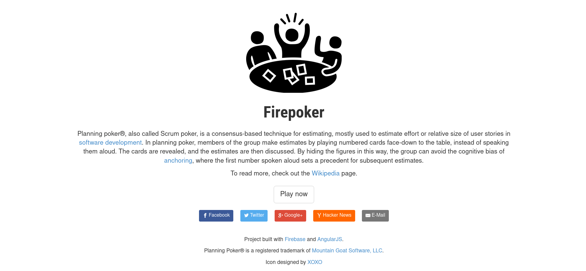

# voyage-project-tier3-planning-poker

## Table of Contents

* [Overview](#overview)
* [General Instructions](#general-instructions)
* [Requirements & Specifications](#requirements-specifications)
* [Acknowledgements](#acknowledgements)
* [About Chingu](#about-chingu)

## Overview

Hey Chingus, it's poker time!

In this voyage, you'll be developing a Scrum Poker app, the go-to agile estimation technique for development teams. 

Just like playing poker with friends, but with a twist – it's all about your tasks! Through this app, you'll not only enjoy the process but also become proficient in the Scrum methodology, gaining valuable insights into your skills and those of your teammates.

But wait, there's more excitement to come! For the first time in Chingu, you'll be integrating the OpenAI API. This means you'll have a virtual teammate joining you in the estimation process, offering valuable insights for each task. How cool is that?

Let's deal the cards and get started!

- Scrum poker example [app](https://firepoker.app/#/)

## General Instructions

This project is designed to be worked on by a team rather than an individual
Chingu. This means you and your team will need to thoroughly read and
understand the requirements and specifications below, **_and_** define and
manage your project following the _Agile Methodology_ defined in the
[Voyage Handbook](https://github.com/chingu-voyages/Handbook/blob/main/docs/guides/voyage/voyage.md#voyage-guide).

As you create this project make sure it meets all of the requirements, but once
it reaches MVP, start implementing the optional features or get creative and
extend it in ways we haven't envisioned. In other words, use the power of
teamwork to make it distinctive and unique.

Take note that we haven't given specific direction on what your UI/UX should
look like. This is another area where you and your team can put your creativity 
to work! 

## Requirements & Specifications

### What You Need to Do

The following define the minimum requirements and ideas for features you may
implement to enhance this app, if time permits.

#### Structure

- [ ] This is a full-stack application. Frontend and backend are required. 
- [ ] Integrate user authentication (sign up and sign in) with database system.
- [ ] You may use any languages, tools, or libraries you prefer when designing and building this app. 
- [ ] Integrate the OpenAI API to build the virtual teammate.
- [ ] You may **_NOT_** use AI-base solution generators like GitHub CoPilot.
- [ ] Useful links and resources:
    - [OpenAI API](https://openai.com/blog/openai-api)
    - [FirePoker app](https://firepoker.app/#/)
    - [Story points](https://asana.com/resources/story-points)

#### Styling

- [ ] Surprise us!!! Use your teams creativity to make this app distinctive.
- [ ] Add a footer containing a link to your teams GitHub repo
- [ ] In general, you will find these [UI design principles](https://www.justinmind.com/ui-design/principles) helpful.
- [ ] Recommend using this resource for [clean CSS](https://israelmitolu.hashnode.dev/writing-cleaner-css-using-bem-methodology)

#### Functionality

-   Overview:
    - [ ] A full-stack application designed to facilitate Scrum poker sessions with a user-friendly interface.

-   User Authentication:
    - [ ] The application must include user authentication functionalities, allowing users to log in and log out securely.
    - [ ] User login and logout forms should be processed through the database to ensure data integrity and security.

-   Creating a Poker Session
    - [ ] Upon successful login, the app prompts the user to enter session details, including the session name, task description and voting scale.
    - [ ] The app supports various [voting scales](https://asana.com/resources/story-points) such as Fibonacci Sequence, T-shirt Sizes, Power of Two Sequence, Linear Scale, etc.
    - [ ] Once session details are selected, the app generates a unique session key.
    - [ ] The user who creates the session shares the session key with their teammates.

-   Joining a Session
    - [ ] When a user receives a session ID or a join link, they should be able to input this information into the app to join the session.
    - [ ] The app should verify the session ID and allow the user to join the corresponding session if it is valid.
    - [ ] Once joined, the user should have access to the session's tasks and be able to participate in the estimation process.

-   Task Estimation Process
    - [ ] During a session, the app should present a task description to the participants.
    - [ ] Participants should be able to input their estimates for the task using the voting interface provided by the app.
    - [ ] The app should aggregate the votes from all participants and calculate the consensus estimate for the task.

-   Session Management
    - [ ] After the session ends, the app should display the final estimation results for each task to all participants.

-   Making a virtual teammate
    - [ ] Develop a backend prompt carefully crafted to set up the app context. Example prompts:
    - "Provide suggestions for estimating the complexity of the following task [task description]. Specify the [voting scale] to be used for estimating this task, along with a brief explanation for your choice."
    - "Estimate how difficult this [task description] is using the [voting scale] and explain why."
    - [ ] Upon submission of the task description and voting scale, send a request to the backend server, passing the input text to the endpoint responsible for interacting with the OpenAI API.
    - [ ] Receive and process the response from the OpenAI API, which may include suggested estimates, explanations for each vote, or insights based on the input text.
    - [ ] Display the OpenAI API suggested estimates with explanations alongside other participants' votes in the app interface. 

-   Responsiveness
    - [ ] Ensure the web application is responsive and accessible across various devices and screen sizes.
    - [ ] Utilize responsive design techniques to adapt to different viewport sizes.
    
### Extras (Not Required)

-   Number of tasks
    - [ ] The app should have more than one task at the same time.

-   Session management
    - [ ] Integrate timer
    - [ ] The session creator should have the ability to start, pause, resume, and end the session as needed.
    - [ ] The app should notify participants about the session status changes (e.g., session started, paused, resumed, ended).

-   User Interaction with Suggestions
    - [ ] Provide options for users to accept, reject, or modify the suggested estimates based on their judgment and expertise.

## Acceptance Criteria

-   User authentication
    - [ ] Users should be able to register, sign up and sign in.
     
-   Creating a Poker session
    - [ ] Users should be able to create a poker session entering the required details.
        - Session name. 
        - Task desctiprion. 
        - Voting scale.
    - [ ] After entering the session details, user should be able to see session key on the screen.

-   Joining a Poker Session
    - [ ] Users should be able to join a session by entering the session key.
    - [ ] Upon joining the session, users should have access to:
        - The session name.
        - Task descriptions.
        - List of joined users.
        - Voting scale options.

-   Task Estimation Process
    - [ ] Users should be able to vote for a certain task without seeing others' votes.
    - [ ] Users should be able to submit their chosen vote by clicking on it.
    - [ ] During the estimation process, the app should utilize the OpenAI API to participate in finalizing results.

-   Session Management
    - [ ] Once the session ends, users should be able to view:
        - The votes of other participants, including OpenAI API voting and suggestions.
        - The final estimation results for each task.

## How to Obtain OpenAI API Key

-   Create an Account:
    - [ ] Visit the OpenAI API website and create an account.

-   Navigate to API Keys:
    - [ ] Once logged in, go to the API keys section in the navigation menu.

-   Generate a New Secret Key:
    - [ ] Click on "Create New Secret Key" to generate your API key.

-   Note for Existing Users:
    - [ ] If you are logged in with a ChatGPT account, you won't have access to a free OpenAI API key. Free keys are available for new users and are valid for three months.

## Acknowledgements

We acknowledge the [OpenAI API](https://openai.com/) for providing three months of free access to their powerful tools and resources, which will greatly enhance the functionality and capabilities of our applications.

## About Chingu

If you aren’t yet a member of Chingu we invite you to join us. We help our 
members transform what they’ve learned in courses & tutorials into the 
practical experience employers need and want.